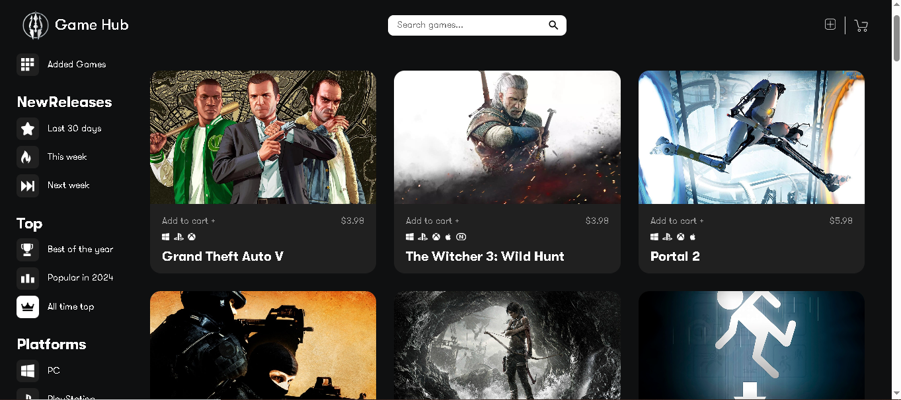
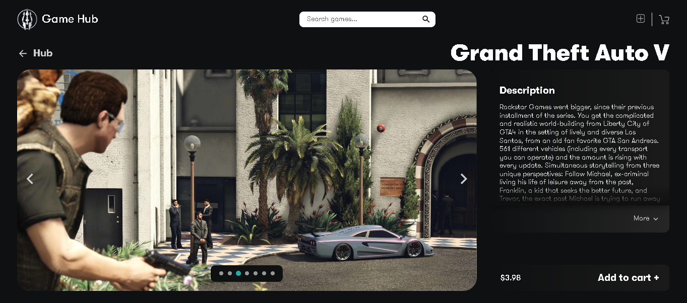
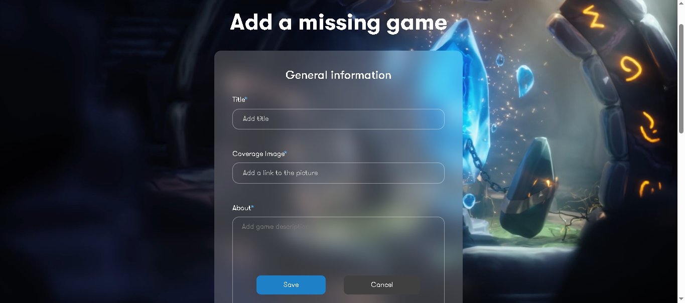

<h1 align='center'>Game Hub</h1>


<h2>Demo</h2>

🔥 [Live Demo](https://b3reketab.github.io/game-hub/)

<h2>Built with</h2>

<h3>Front-End</h3>

- React
- Redux ToolKit
- TypeScript
- Styled-Components
- RAWG API

<h3>Back-End</h3>

- Node.js
- Express
- MongoDB

</br>

<h2>Features</h2>

- Extensive catalog of games thanks to the [RAWG API](https://rawg.io/apidocs).
- Search any game you want.
- Game information and screenshots.
- Responsive design.
- Filters to find exact genre or release period.
- Cart for games user wants to 'buy'
- Custom API to store and display missing games

</br>

<h2>Screenshots</h2>






</br>

<h2>Custom API endpoints</h2>

</br>

<h2>Development</h2>

Here are the steps to start the project locally.

1. Clone the repository.

```sh
HTTPS - $ git clone https://github.com/b3reketab/game-hub.git
or
SSH - $ git clone git@github.com:b3reketab/game-hub.git
```

2. Move to the cloned directory.

```sh
$ cd game-hub
```

3. Install the dependencies.

```sh
$ npm i
or
$ yarn
```

4. [Create a RAWG account](https://rawg.io/apidocs) to get your API key.

5. Create <code>.env</code> file in the root directory.

6. Add: <code>VITE_RAWG_API = YOUR API KEY</code>. (Remember to replace <code>YOUR API KEY</code> with generated key after creating and account)

7. Start the project.

```sh
$ npm start
or
$ yarn start
```
